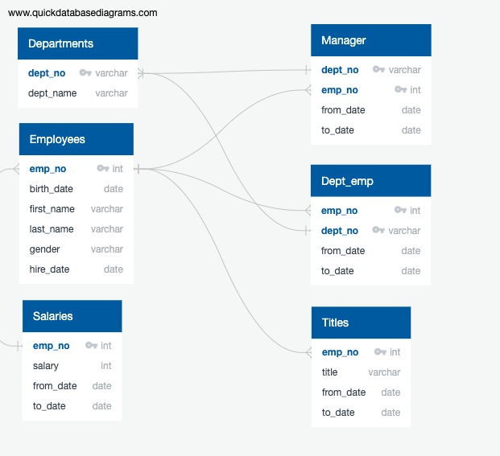

# Pewlett-Hackard-Analysis

## Project Overview & Purpose
The purpose of this analysis was to help Pewlett-Hackard determine the number of retiring employees per title, and identify employees who are eligible to participate in a mentorship program. 

To perform the analysis, I used Database Diagram to determine primary and foreign key in each data given. Then I used SQL queries in pgAdmin to filter, join, and retrive relevant data for the given analysis.

## Resources
Data Source: departments.csv, dept_emp.csv, dept_manager.csv, employees.csv, salaries.csv, titles.csv
Software: PostgreSQL, pgAdmin

The purpose of the new analysis is well defined. (3 pt)
Results:

There is a bulleted list with four major points from the two analysis deliverables. (6 pt)
Summary:

The summary addresses the two questions and contains two additional queries or tables that may provide more insight. (5 pt)
