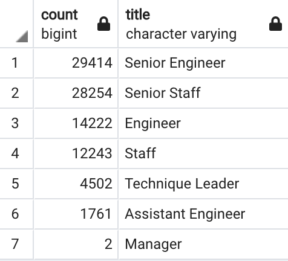

# Pewlett-Hackard-Analysis

## Project Overview & Purpose
The purpose of this analysis was to help Pewlett-Hackard determine the number of retiring employees per title, and identify employees who are eligible to participate in a mentorship program. 

To perform the analysis, I used Database Diagram to determine primary and foreign key in each data given. Then, I used SQL queries in pgAdmin to filter, join, and retrive relevant data for the given analysis.

## Resources
Data Source: departments.csv, dept_emp.csv, dept_manager.csv, employees.csv, salaries.csv, titles.csv
Software: PostgreSQL, pgAdmin

## Results

### Number of retiring employees per title
  * We identified the individuals nearing retirement age by joining two CSV data Employees and Titles using primary key, employee number. Then filter data by birthdates between 1952 and 1955. After the review, there are duplicate names as employee changed titles over time so we applied DISTINCT function to remove duplicates and account for most recent title only. After removing the duplicates, our total retirement data decrease from 133,776 employees to 90,398 employees.
  * We have also create a new table showing the count of individuals nearing retirement age by department. We were able to determine that 29,414 Senior Engineer, 28,254 Senior Staff, 14,222 Engineer, 12,243 Staff, 4,502 technique Leader, 1,761 Assistant Engineer, and 2 manager will be retiring. This allows the company to determine the department and amount of employees to hire.
  
### Eligibility to participate in a mentorship program
  * We wrote a query to create a table showing the employees that are eligible to participate in a mentorship program (current employees who were born between January 1, 1965 and December 31, 1965). We create a complete data table by joining employees, dept_emp, and titles data on primary key. We found that 1,549 employees eligible for the program.
  * Most of the employees eligible for the mentorship program are Senior Engineer, Senior Staff, and Engineer.

## Summary
Pewlett-Hackard will need to fill 90,398 roles due to “silver tsunami” as many current employees reach retirement age.The analysis allows the company to ensure the headcount per department is filled.

There are about 1,549 employees eligible in the mentorship program who will be able to mentor new joiners at the company. The mentor to new employee ratio is not great as the range for eligible mentor is only one year while we used three year range to identify potential retirees. This results in large numbers of new employees to mentor which may note be effective.

Our suggestion is for the company to create additional query to identify eligible employee to join the mentorship program. These individuals can be identified by position such as senior title instead of birth date year. We can also identify more eligible mentors by using a larger range (3 year for eligible mentor). This way, Pewlett-Hackard's mentor and new employee ratio will be lower which will allow more 1:1 time and effective training.

